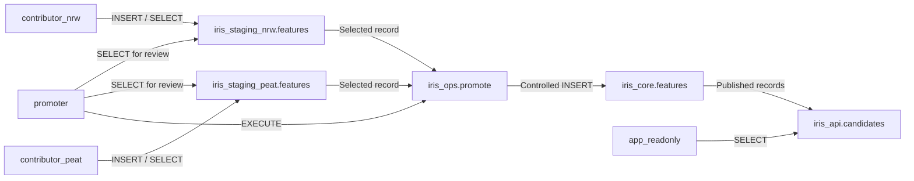
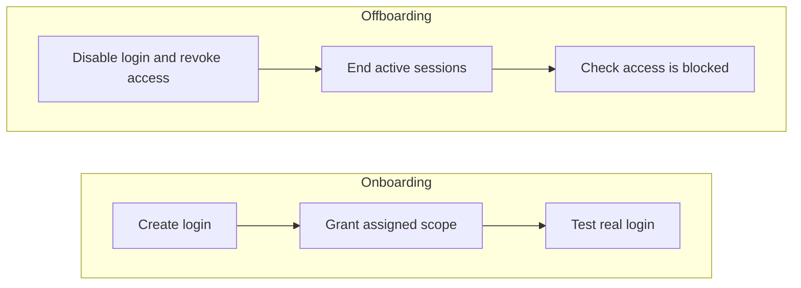

# IRIS - Contributor database isolation

Each contributor loads data into an assigned staging area. A promoter reviews
and publishes selected records. The app reads the published data through a view.
PostgreSQL enforces these permissions for every connection.

[Design decisions](PRESUPPOSITIONS.md) · [Test results](VALIDATION.md)

## Start locally

You need Docker with Compose v2 and Python 3.12+. On WSL, enable Docker Desktop
integration. On Windows, use `python` if `python3` is unavailable.

Run these commands from the project root. Skip the first command if `.env`
already exists. **The tests clear all records in the staging and core tables.**

```bash
python3 scripts/init_env.py
docker compose up -d --wait db
docker compose build verify
docker compose run --rm verify
docker compose run --rm verify python -m iris
```

The password script creates `.env`, which is excluded from Git and container
images. The last command loads and publishes three sample records, then reads
them as the app. Running it again leaves existing records unchanged.

The database is available at `127.0.0.1:55432`. Compose uses PostgreSQL 16,
PostGIS 3.5, and Python 3.12.

Stop the services with `docker compose down`. To delete the local database,
run `docker compose down -v`. Start it again to create a fresh database.
Setup runs only on an empty volume; editing `.env` does not change passwords
in an existing database.

### Upgrade an existing database

For a database initialized before migration `004_hardening.sql`, disconnect runtime
clients and apply this migration once, without deleting the volume:

```bash
docker compose exec db psql -X -U postgres -d iris --single-transaction \
  --set=ON_ERROR_STOP=1 --file=/iris-sql/004_hardening.sql
docker compose build verify
```

The migration removes public access to other databases in this dedicated cluster
and validates coordinate bounds on existing staging and core rows. It preserves
the records. If any geometry is outside the bounds, the whole migration rolls back;
investigate and explicitly correct the source data before retrying. Fresh installs
apply the migration automatically. CONNECT revocations affect new connections,
which is why existing runtime sessions must be disconnected first.

## Who can do what

| Role               | Access                                               |
| ------------------ | ---------------------------------------------------- |
| `contributor_nrw`  | Read and insert into `iris_staging_nrw.features`     |
| `contributor_peat` | Read and insert into `iris_staging_peat.features`    |
| `promoter`         | Read both staging tables and call `iris_ops.promote` |
| `app_readonly`     | Read `iris_api.candidates`                           |



These accounts cannot edit or delete staging rows, change table definitions,
write directly to core, or assume another role. New tables and functions need
explicit grants. PostgreSQL system metadata remains visible.

The cluster is dedicated to IRIS. Bootstrap removes `PUBLIC` database privileges
throughout the cluster, including `postgres` and `template_postgis`; runtime roles
receive `CONNECT` only on `iris`. If an administrator creates another database
later, revoke its `PUBLIC` privileges before allowing clients to connect:

```sql
REVOKE ALL ON DATABASE new_database FROM PUBLIC;
```

Two roles own the database objects: `iris_owner` owns the tables and view, and
`iris_promote_executor` owns the promotion function. Neither role allows login.
The function owner can read staging, insert into core, and read the key columns
needed to check for duplicates. This keeps ownership separate from user access.

## Publish a record

Open a session as the promoter:

```bash
docker compose exec db sh -c 'PGPASSWORD="$IRIS_PROMOTER_PASSWORD" psql -X -h 127.0.0.1 -U promoter -d iris'
```

Review the staging data, then publish a record:

```sql
SELECT * FROM iris_staging_nrw.features;
SELECT iris_ops.promote('nrw', 'DE', 'fixture-001');
-- 1 = inserted; 0 = already published
```

The function accepts `nrw` or `peat`, a country code, and a source ID. Calling it
approves that record. It copies the record into core and keeps the staging row.

Invalid arguments or missing records cause an error. Repeated or simultaneous
calls cannot create duplicates or overwrite published data. Rolling back the
transaction also rolls back publication.

The function uses `SECURITY DEFINER` to run with its owner's limited permissions.
Fixed table references and a fixed `search_path` prevent callers from redirecting
it to other objects. See the [PostgreSQL guidance](https://www.postgresql.org/docs/16/sql-createfunction.html#SQL-CREATEFUNCTION-SECURITY).

## Read published records

Open a session as the app:

```bash
docker compose exec db sh -c 'PGPASSWORD="$IRIS_APP_PASSWORD" psql -X -h 127.0.0.1 -U app_readonly -d iris'
```

Query the published view:

```sql
SELECT country_code, dataset, source_id FROM iris_api.candidates;
```

Use `\q` to leave either database session.

## Data rules

Every record needs these fields:

| Field          | Accepted value                                          |
| -------------- | ------------------------------------------------------- |
| `country_code` | Two uppercase letters                                   |
| `source_id`    | Nonempty source identifier                              |
| `geom`         | Valid, nonempty 2D MultiPolygon with explicit SRID 4326 |
| `source_date`  | Source date                                             |
| `uncertainty`  | Nonempty description; state when accuracy is unknown    |

Each staging table uses `(country_code, source_id)` as its key. Core uses
`(country_code, dataset, source_id)`. Use the same fields when joining records.
Permissions are assigned by dataset. Country codes are checked for format only.

Coordinates are longitude and latitude in degrees. Missing CRS or required
fields are rejected. Longitude must be within [-180, 180] and latitude within
[-90, 90], including the endpoints. These bounds are enforced in staging and core.
Geometry is not automatically transformed or repaired; bounds checks cannot
identify a wrong CRS label when the supplied numbers still fall inside the bounds.

`fixtures/features.json` contains three synthetic records for NRW/DE and
peat/DE/NL. They reuse one source ID to test country and dataset isolation.
These are test records, not real source data.

## Run tests

Use the local test database: **each test clears the staging and core tables.**

```bash
docker compose run --rm verify
```

Tests use real role logins. They check allowed and blocked operations, data
validation, coordinate bounds, connections to other databases, duplicate prevention,
simultaneous publication, and access removal.
See [VALIDATION.md](VALIDATION.md) for recorded results.

To save the SQL output in Bash:

```bash
mkdir -p artifacts
set -o pipefail
docker compose run --rm verify 2>&1 | tee artifacts/permission-tests.txt
```

## Add or remove a contributor



To add a contributor, enter a new password in Bash and open an admin session:

```bash
read -rs -p "New contributor password: " IRIS_NEW_PASSWORD
export IRIS_NEW_PASSWORD
docker compose exec -e IRIS_NEW_PASSWORD db psql -X -U postgres -d iris
```

Run this SQL to grant access to NRW staging:

```sql
\getenv new_password IRIS_NEW_PASSWORD
BEGIN;
CREATE ROLE contributor_example LOGIN NOSUPERUSER NOCREATEDB NOCREATEROLE
  NOINHERIT NOREPLICATION NOBYPASSRLS PASSWORD :'new_password';
GRANT CONNECT ON DATABASE iris TO contributor_example;
GRANT USAGE ON SCHEMA iris_staging_nrw TO contributor_example;
GRANT SELECT, INSERT ON iris_staging_nrw.features TO contributor_example;
COMMIT;
```

Exit with `\q`, then run `unset IRIS_NEW_PASSWORD` in your shell. Sign in with
the new account and enter its password when prompted:

```bash
docker compose exec db psql -X -h 127.0.0.1 -U contributor_example -d iris
```

Check its access:

```sql
SELECT country_code, source_id FROM iris_staging_nrw.features; -- allowed
SELECT * FROM iris_staging_peat.features;                     -- denied
SELECT * FROM iris_core.features;                             -- denied
```

Exit with `\q` when finished.

To remove access, open an admin session:

```bash
docker compose exec db psql -X -U postgres -d iris
```

Run:

```sql
BEGIN;
ALTER ROLE contributor_example NOLOGIN PASSWORD NULL;
REVOKE SELECT, INSERT ON iris_staging_nrw.features FROM contributor_example;
REVOKE USAGE ON SCHEMA iris_staging_nrw FROM contributor_example;
REVOKE CONNECT ON DATABASE iris FROM contributor_example;
COMMIT;
SELECT pg_terminate_backend(pid)
FROM pg_stat_activity
WHERE usename = 'contributor_example' AND pid <> pg_backend_pid();
```

Remove any additional grants or memberships too. Confirm existing sessions end
and new connections fail. Disabling login alone does not end active sessions.
The contributor's data stays in place.

To add a dataset, create its staging table as `iris_owner`, add a promotion branch,
update the core dataset constraint, and add the required grants and tests.

## Run without Docker

Install Python 3.12+, PostgreSQL 16+, and the PostGIS 3.4+ server package. Create an
empty `iris` database in a dedicated local cluster with SCRAM authentication.
Generate `.env` with `python3 scripts/init_env.py` if it does not exist, and set
that cluster's `postgres` password to match `POSTGRES_PASSWORD`.

Run from the project root, adjusting the host and port for your cluster:

```bash
set -a
. ./.env
set +a
export PGHOST=127.0.0.1 PGPORT=55432 PGDATABASE=iris
export PGUSER=postgres PGPASSWORD="$POSTGRES_PASSWORD"
psql -X -v ON_ERROR_STOP=1 -f sql/bootstrap.sql
python3 -m venv .venv
.venv/bin/pip install -r requirements.txt
IRIS_TEST_RESET=1 .venv/bin/python -m pytest -v -s
.venv/bin/python -m iris
```

Database setup runs once and requires unused role names. Tests check for the
setup marker and `IRIS_TEST_RESET=1` before clearing data.

## Files

- `sql/`: roles, tables, promotion function, and grants.
- `iris/`: database helpers and the sample-data command.
- `tests/` and `fixtures/`: automated checks and sample records.
- `scripts/`: password generation and database startup.
